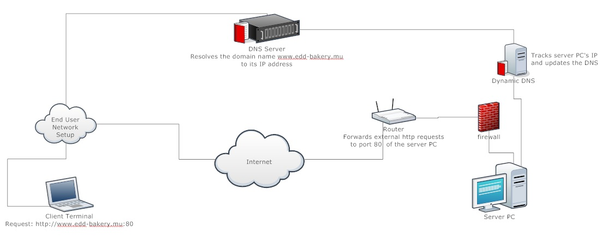
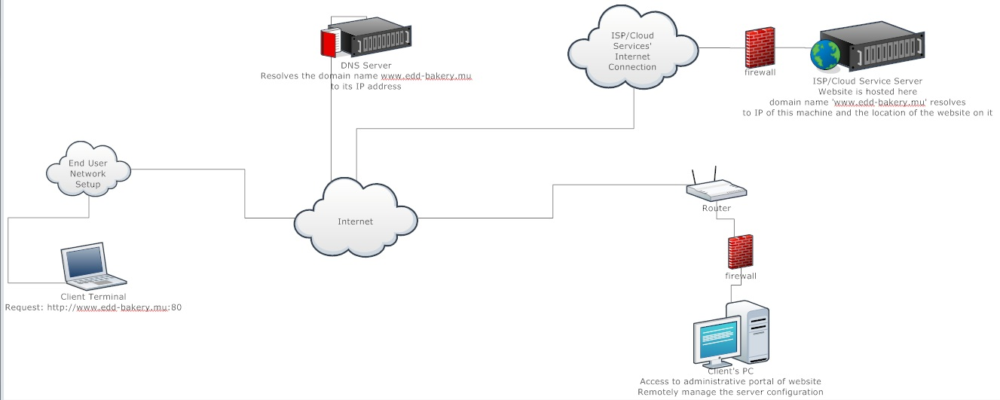

# Web-Centric Computing Assignment 1 #
## Abstract ##

Epi de Dieu Ltée” is a noteworthy bakery and pastry shop in Quatres-Bornes. 
It has been set up in 2002 with the intent of providing the vicinity 
with baked goods and all things cake.
The owners thence set out to provide catering services and daily delivery of staple bakeries. 
Recent expansion brought such additions as assuring backup supply of goods to retail stores 
and home delivery of orders to the business’ services.
In the same vein, “Epi de Dieu Ltée” adopted a computerized business management solution, 
resulting in an extant, to-date IT set-up with a working internet connection; 
analogous to a client’s expected computing infrastructure.

---

## Introduction ##
### The Company ###

“Epi de Dieu ltée” is owned and run by its founder, Mrs Thomas,
who counts amongst the 4 employees of the business.
It comprises of a bakery contiguous to a retail outlet where its goods are sold
The bakery operates every day from 05:30 to 20:30, with the exception of 
Sundays on which it closes at 21:30.  
From its establishment,
it has succeeded to catch the interest of a regular loyal customer base with
its variety of baked & pastry products.  
Nonetheless, to continue being successful, EdD ltée must seek to modernise its 
operations to cope with the competition.

### Products & services ###

As part of its provided services, the bakery produces a certain daily supply of bread and 
cakes intended for individual consumption as well as for supplying local shops.
The shop also provides catering services for special occasions such as parties, 
weddings or anniversaries, 
and now also undertakes orders from large-scale retailers in the likes of 
the ‘Super-U’ and ‘Jumbo’ supermarkets.
Currently orders are placed either via phone call or in person on the premises.

An outline of some processes we are to consider yields:

- Taking orders  
“Epi de Dieu ltée” offers customers the possibility of placing orders 
ahead of a time where the client comes 

- Responding to customer queries  
“Epi de Dieu ltée” receives quite a number of phone enquiries about the 
products of the shop (the different items available, the stock and their 
price)

+ Serving customers  
To benefit from the advantages that this solution provides, “Epi de 
Dieu ltée” recently computerised their bookkeeping processes. 
Nonetheless, the system in place is not optimal; 
The person serving customers uses a spreadsheet to log sold items. The data is then 
input directly into their database tables at the end of the day.

+ Delivery  
“Epi de Dieu ltée” provides delivery to local shops, large-scale 
retailers as well as individuals, depending on the nature of the order 
and the proximity. 

### Problem Statement ###

The problems faced by the client can be outlined as:
- Info about the products of the shop are only accessible to people 
having access to the shop itself

- A large amount of redundant phone queries about products of the 
shop is consistently received 
	
- Taking orders exclusively via phone calls is inefficient in that 
it may lead to errors 
 

<!--- Edd ltd, hereinafter referred to as “the client”  is an ex

The problems faced by edd ltd are typical of 
With the advance of

-->

## Attempt at a solution ##

To the incurred problems, we propose a web-based solution: A website showcasing the client’s business
and services and acting as a portal to the later by enabling customers to place orders.
The aims of the website are various; to display updated information about the business and its products 
to customers, to provide customers a modern way of performing transactions as well as creating a 
web presence for the business in the view of identifying potential leads.

## Description of Proposed System ##

The proposed system is centered around a website.  
The latter would be host to information about the business, be a 
means of two-way communication with the business and enable users 
to buy products of the business.  
Users will have the option to register to benefit from a 
personalised experience.  
The solution will also feature a web-app that will only be 
accessible the business's owner.  
The web-app will be connected to the website's database and 
consist of a dashboard which will, for instance, display the 
description and of orders for the day and the business's stock.  
It will also double as a Point-Of-Sales app to be used at the shop's 
counter, replacing the current spreadsheet, such that sales 
immediately update stock in the database. ...  

## Justification ##

The client currently relies on traditional means of advertising 
such as business cards, poster adverts etc.  
A website enables the business to tap into a certain demographic 
unattainable before: 
that of the ever-growing user base of internet services. 
It's setup is followed by the adoption of digital marketing strategies 
such as display advertising, search engine optimization 
(online visibility) and social media marketing 
(Facebook, Tumblr, Google+). 
These techniques have proven to be more affordable compared to 
traditional marketing, to increase profitability in terms of 
revenues, to improve connectivity with the customer and to offer 
real-time results for the business strategies employed (web traffic). 
In that view, the website can serve the purpose of building brand image 
while maintaining a competitive approach in the catering business,
which is important for survival as well as for business expansion. 
We postulate that an online presence for Epi de Dieu ltée would 
help it gain an edge over its competitors in its field.  

A website provides a 24/7 service, making the information 
available at any time. The clients can also contact the pastry 
through messages or mail, means which are non-intrusive to the business. 
This would result in a streamlined workflow with fewer interruptions 
since employees will not be required to answer phone calls.

those would considerably increase the productivity of the business,
decrease paper work and related inventory stock and also making 
a better planning of stock all those making the business more cost 
efficient.
Finally the website is easily accessible from any devices such as 
smartphones, tablets, or laptops that are connected 
through mobile data or internet. The latter would be updated every 
day so as to keep our clients in the loop for any changes that would 
be made or any sort of promotions that would be available.

An order portal produces direct revenue and measurable profit

 

A web-app has the advantage that it is easily scalable.  
It also, is consistently accessible from a range of devices 

## Technological considerations ##

Below is a non-exhaustive rundown of the main technologies to be considered 
when developping the solution. The constraints 

### HTML5 and CSS3 ###

The website's and web-app's front-end will be built using **HTML** as markup
language, and **CSS** as style sheet language.  

It will be developped adhering to the latest W3C specifications of the
HyperText Markup Language's and Cascading StyleSheets' syntax and semantics,
namely, **HTML5** and **CSS3**. Those specifications

Constraints:
- Client-side: *Requires an HTML5 compliant user-agent*
- Server-side: *Requires an HTTP Server*

### JavaScript ###

Constraints:
- Client-side: *Requires a user-agent featuring a JavaScript engine*
- Server-side: *None*

Performance Note:  

### AJAX / AJAJ ###

*Asynchronous JavaScript and XML* (**AJAX**) is a methodology employing 
handling of user-generated events, data retrieval and DOM manipulation to the 
ends of dynamically adding or modifying the page's content.  
This increases a web page's interactivity, speed and usability.  
The procedure provides the advantage that its server requests are 
*non-blocking* in nature (requests do not interrupt interaction with the page) 
and do not require reloading an entire page to display new content which is 
dependent upon the user's actions.
In the AJAJ variant, data is transported strictly in **JSON** instead of 
**XML** or plain-text in AJAX.  
Using raw AJAX/AJAJ calls creates no dependency (on javascript libraries for 
instance).  

Constraints:
- Client-side: *A user-agent adhering to the XMLHttpRequest Object Standards*
- Server-side: *None*

Performance Note:  

### Markdown ###

**Markdown** is a mark-up language intended for web-writing.
It is intended to be as easy to write as it is easy to read.
As such, it would be a nice addition to the website's CMS to 
enable easy styling from the administrator.  
Markdown's syntax can easily be converted to HTML by parsing it on 
the server, thus adding no dependency of support by 
rendering engines.  

Constraints:
- Client-side: *None*
- Server-side: *Requires parsing and conversion to HTML*

Server Side Technologies  

### Apache HTTP Server ###

### PHP Hypertext Preprocessor ### 

### RDBMS ###

Development-Oriented Technologies

### Source Code Editor ###

### CSS Preprocessor ###

A CSS preprocessor is an interpreter or compiler that dynamically interprets 
or precompiles a scripting language to CSS. It aims to extend the CSS 
language by injecting constructs - such as variables, functions, inheritance, 
and mixins - from programming languages (particularly Object-Oriented ones) 
into CSS scripting; such that the latter's WET *(Write Everything Twice)* 
static rules are dropped in favour of clean DRY *(don't repeat yourself)* 
code.

Preprocessors are invaluable tools for building CSS frameworks for their 
philosophy promote themability (global changes), maintainability, and 
extensibility.  

Lastly, considering the compiled version of **SASS** and **LESS** 
preprocessors, it should be noted that:
1. Pure CSS is already valid SasScript and LesScript.
2. Preprocessing CSS *cascades* (pun intended) no dependency down to the 
client or server infrastructure since it compiles to scripts in pure CSS3.  

Constraints:
- Client-side: *None*
- Server-side: *None*

### Linting ###

A lint is a tool developed to flag non-portable programming constructs 
or those which do not adhere to the language's semantics or philosophy, 
generally by means of static source code analysis.  
To quote CSSLint.net: <cite>"CSS LINT. Will hurt your feelings*.
(And help you code better)".</cite>
 
The lints we are to consider for our purposes are **CSSLint**, **JSLint**  
HTML5 standard compliance will be ensured by validation HTML code 
through the **W3C validator service
**  
Constraints:
- Client-side: *None*
- Server-side: *None*

 

## Requirements of the Web platform ##

Based on the above analysis of the different techologies to be implemented, 
it is possible to produce a set of specifications outlining the requirements 
of the website's host environment.  

### Hardware Requirements ##

Statistics of concurent Mauritian users of a website. Expected Load.  

**Processing Power**  

**Random-Access Memory**

**Disk-Access Latency**

An aspect of the server's Hard-Drive which might act as bottleneck if not 
optimised is disk-access latency.  
For that reason, Solid-State Disks are preferred to Hard-Disk Drives as 
storage media on the server.  

**Bandwidth**  

### Software Requirements ###

**Operating System**
**Apache Installation**
**php.exe**
**RDBMS**

### Constraints ###

### Performance Considerations ###

The definite requirements of the server will be known once 
performance benchmarks of the website are performed at an advanced 
stage of the website's development.  
Benchmarking v/s Stats  
The software to be used for the application as well as its supporting 
hardware was chosen with  

### Security Issues ###

The website will be facing the internet which is considered to be 
an environment where 'anything can happen'. The former and the server 
hosting it should therefore be equipped to cope with most of those 
eventualities.  
This ensures that the website stays reliable and that critical 
information is kept confidential.  

To this intent:
1. The server should always be free of malware
>An up-to-date anti-malware system must be up and running on 
the server
2. Security of transactions should be ensured
>Monetary transactions (i.e.: placing orders...) shall be 
delegated through appropriate APIs to secure online payment 
gateway services, such as the ones provided by the *Mauritius 
Commercial Bank* or *paypal.com*
3. User information shall be appropriately encrypted prior to storage 
4. Attempts of intrusion should be detected and terminated
>Attempts at connections to other open ports on the server shall be 
prevented by setting up a firewall on the server.  
Furthermore, an Intrusion Detection System (IDS) must be set up 
to detect and deter suspicious/malicious activities on trusted ports.

## Hardware Implementation ##

For the website to be accessible on the internet, the files making it up 
need to *sit* on a host server - essentially an always on pc *hardwired* 
to the internet.  
That host pc can then be accessed through the IP address assigned to 
it by a Local Internet Registry (usually an ISP) and the files located 
to access the website.  
But the optimal solution is to register a meaningful Domain Name -
through a Domain Name Registrar - which will link to the website and be 
used to access it.  

The options to consider for a hosting solution are:  

**1. Configuring the client's PC as a server**

>Pros: 
>- Flexibility to implement your own tools and technologies and 
change the former without incurred cost.  

>Cons:
>- Speed at which users get served content is limited by the connection's 
upload speed, which is very low
>- The server needs to stay on all day, everyday; resulting in much 
energy wastage, even more important considering the idle time 
>- A server needs maintenance such as updating the software 
infrastructure, applying patches, taking necessary measures if 
suspicious activity is found logged. This can not be left to 
the client

**Note**: Due to the dynamic nature of the IP address leased by 
Internet Service Providers to individual subscibers, a Dynamic
DNS Service has to be used to track IP address changes and amend 
the DNS registry.  

A Network diagram of this configuration is:  

**2. ISP web-hosting services**

>Pros:
>- Has high-speed connection to the internet so the site vistitor's 
download speed is actually the limiting factor 
>- Offers a very high degree of uptime and reliability 
>- Has a secure operating environment

**3. Cloud web-hosting services**

>Pros:
>- Has high-speed connection to the internet so the site vistitor's 
download speed is actually the limiting factor 
>- Offers a very high degree of uptime and reliability 
>- Has a secure operating environment
>- Much more cost-effective than ISP hosting solutions
>- Offers domain-name registration at lower costs

Those two configurations have similar network diagrams:  

  

For the advantages it provides, a cloud hosting solution will be 
implemented to host the site once it is developped.  
This solution will require no additional hardware from the part 
'Epi de Dieu ltée'.
A suitable domain name will also be registered through cloud 
service provider.